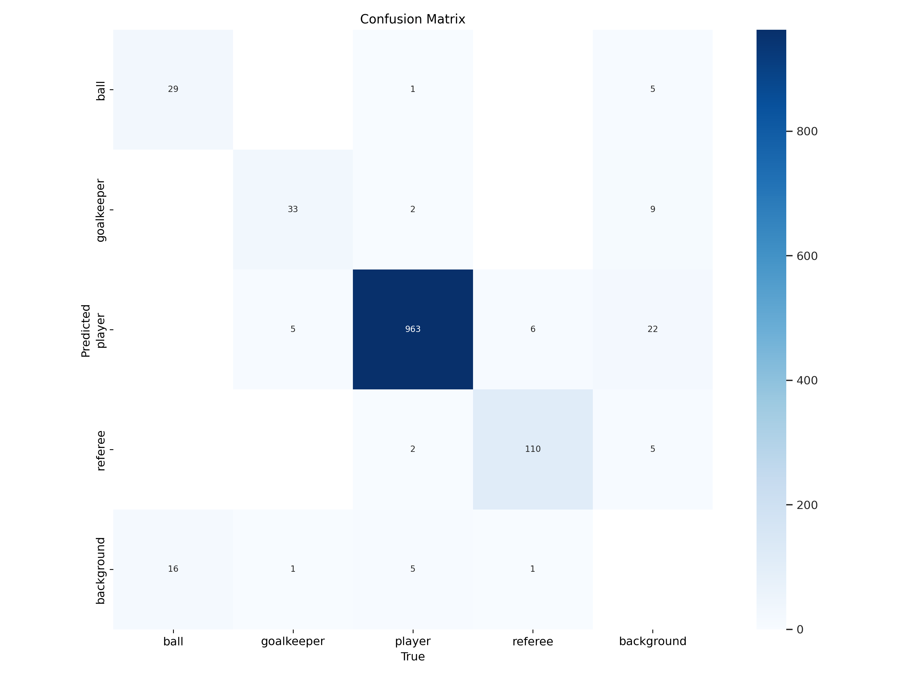
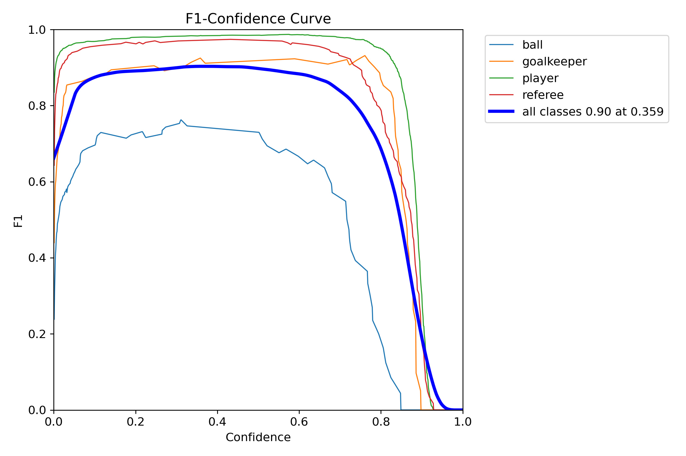

# football-player-tracking-yolo


Example of player tracking using YOLOv12L and ByteTrack

## Objective

- Fine tune YoLo model for football player datasets
- Separate players from each team
- Detect ball more accurately
- Track all the players using tracking algorithm
- Easily switch between different YOLO models (Ultralytics) and trackers via Hydra configuration

### Data

Dataset are downloaded from [Roboflow universe](https://universe.roboflow.com/roboflow-jvuqo/football-players-detection-3zvbc/model/12)
**Number of classes** - Ball, goalkeeper, player, referee

## ✨ Key Features

- **Modular Design:** using SW development best practices (OOP)
- **Configuration Management:** Uses [Hydra](https://hydra.cc/docs/intro/) for flexible configuration via YAML files and command-line overrides.
- **Pre-trained Weights:** Leverages pre-trained weights for the YOLO from [ultralytics](https://docs.ultralytics.com/tasks/detect/).

## 🛠️ Technologies Used

- **Python:** Core programming language.
- **Pytorch:** Deep learning framework.
- **YOLO Models (Ultralytics):** Object detection models (e.g., YOLOv8, YOLOv12L)"
- **Tracking Algorithm**: ByteTrack, BotSort
- **Jupyter Notebook:** For exploratory data analysis (EDA), model development, and training.
- **Hydra:** Configuration management.
- **Roboflow:** Dataset management and download.
- **Docker:** Containerization for consistent environment.
- **VS Code Dev Containers:** Development environment setup.

## Project Structure

```
├── configs
│   ├── annotate
│   │   ├── default.yaml
│   │   ├── ellipse_annotator.yaml
│   │   ├── label_annotator.yaml
│   │   └── triangle_annotator.yaml
│   ├── common
│   │   └── color_palette.yaml
│   ├── datasets
│   │   ├── default.yaml
│   │   └── football_player_dataset.yaml
│   ├── extras
│   │   └── default.yaml
│   ├── hydra
│   │   └── default.yaml
│   ├── inference.yaml
│   ├── models
│   │   ├── auto_processor.yaml
│   │   ├── default.yaml
│   │   ├── siglip_vision_model.yaml
│   │   ├── team_classifier.yaml
│   │   └── yolo.yaml
│   ├── paths
│   │   └── default.yaml
│   ├── tracker
│   │   ├── bot-sort.yaml
│   │   ├── bytetrack.yaml
│   │   └── default.yaml
│   ├── trainer
│   │   └── default.yaml
│   └── train.yaml
├── data
├── Dockerfile
├── LICENSE
├── notebooks
│   ├── 01_exploratory_data_analysis.ipynb
│   ├── 02_yolo_model_training.ipynb
│   ├── 03_yolo_model_inference.ipynb
│   └── 04_model_training_for_different_team_players.ipynb
├── pretrained_models
├── pyproject.toml
├── README.md
├── results
├── ruff.toml
├── scripts
│   └── video-to-giff.sh
├── src
│   ├── inference.py
│   ├── models
│   │   └── team_classifier.py
│   └── model_trainer.py
└── uv.lock
```

## 🔧 Setup & Installation

1. **Clone the repository:**

   ```bash
   git clone https://github.com/vivekpatel99/football-players-tracking-yolo.git
   cd football-players-tracking-yolo
   ```

2. **Install VS Code Extensions:**

   - Docker (`ms-azuretools.vscode-docker`)
   - Dev Containers (`ms-vscode-remote.remote-containers`)

3. **Set up Environment Variables:**

   - Create a `.env` file in the project root directory.
   - Add your Roboflow API key. This is needed if you plan to download datasets directly via Roboflow scripts (if applicable).

   ```dotenv
   # .env
   ROBOFLOW_API_KEY=YOUR_ROBOFLOW_API_KEY
   # Optional: Define dataset path if not using default
   # DATA_ROOT=/path/to/your/dataset
   ```

   - *Note: The `.env` file is gitignored for security.*

4. **Build and Open in Dev Container:**

   - Open the cloned repository folder in VS Code.
   - Press `Ctrl+Shift+P` (or `Cmd+Shift+P` on macOS).
   - Type and select `Dev Containers: Rebuild and Reopen in Container`.
   - This will build the Docker image and start the development container. VS Code will automatically connect to it.

5. **Install Dependencies (inside the container):**

   - Once the container is running, open a terminal within VS Code (`Terminal > New Terminal`).
   - Install the required Python packages:

   ```bash
   pip install -r requirements.txt
   ```

## Data Preparation

1. **Download:** Download the dataset from the [Roboflow link](https://universe.roboflow.com/roboflow-jvuqo/football-players-detection-3zvbc/model/12) provided above. Choose the desired format (e.g., YOLOv5 PyTorch).
2. **Organize:** Place the downloaded and extracted dataset into a directory structure expected by your configuration (e.g., `data/football-players-detection`). Ensure the `data.yaml` file provided by Roboflow is present.
3. **Configure Path:** Update `configs/data/default.yaml` (or override via command line/`train.yaml`) to point to the correct dataset directory and `data.yaml` file if necessary. By default, it might look for `./data/football-players-detection`.

## ⚙️ Configuration

- This project uses Hydra for managing configurations.
- The main configuration file is `configs/train.yaml`.
- It composes configurations from subdirectories like `configs/model`, `configs/data`, etc.
- You can modify parameters directly in the YAML files or override them via the command line.

**Example:** Change the model size and learning rate via the command line:

```bash
python src/train.py models.model_name=yolov8m trainer.params.batch=16 trainer.params.lr0=0.001
```

**Run Inference on Video**

```bash
python src/inference.py paths.ip_vid_path=<input video path>
```

## 🏋️ Training

1. **Ensure Setup:** Make sure you have completed the Setup & Installation and Data Preparation steps.
2. **Configure:** Modify `configs/train.yaml` or specific sub-configs (`configs/model/default.yaml`, `configs/data/default.yaml`, etc.) as needed for your experiment (e.g., epochs, batch size, model variant).
3. **Run Training:** Execute the training script from the project root directory within the Dev Container terminal:
   ```bash
   python src/train.py
   ```
   - You can override configuration parameters directly from the command line using Hydra's syntax (see Configuration section example).
4. **Output:** Training logs, checkpoints (`.pt` files), and other artifacts will be saved in a directory under `outputs/`. The exact path is determined by Hydra based on the date and time of the run (e.g., `outputs/YYYY-MM-DD/HH-MM-SS/`). Checkpoints are typically saved in a `checkpoints/` subdirectory within the run folder. Validation metrics are printed to the console during training.

## Models

- This project uses the **YOLOv8** (or specify e.g., YOLOv5, YOLOv7) object detection model architecture.
- We start with weights pre-trained on the COCO dataset provided by Ultralytics (or the source you used).
- The model is then fine-tuned on the custom football player dataset mentioned above.
- The best performing fine-tuned weights from our training runs can be found in the Hydra output directory (`outputs/`). *(Optionally: Add a link here if you host specific trained weights, e.g., using GitHub Releases)*

## 📈 Results & Visualizations

The following results were obtained using the fine-tuned YOLOv12L model with an input size of 1280x1280:

**Confusion Matrix**

**F1 Curve**


**Validation Metrics:**

| Class      | Images | Instances | Precision (P) | Recall (R) | mAP50 | mAP50-95 |
| :--------- | -----: | --------: | ------------: | ---------: | ----: | -------: |
| all        |     49 |      1174 |         0.948 |      0.880 | 0.916 |    0.675 |
| ball       |     45 |        45 |         0.933 |      0.618 | 0.716 |    0.341 |
| goalkeeper |     38 |        39 |         0.902 |      0.947 | 0.968 |    0.777 |
| player     |     49 |       973 |         0.978 |      0.991 | 0.994 |    0.840 |
| referee    |     49 |       117 |         0.978 |      0.966 | 0.987 |    0.743 |

## 🖥️ Hardware Specifications

NOTE: To enhance ball detection accuracy, the YOLOv12L model was trained using an image size of 1280x1280. Training was performed using Lightning Studio to ensure sufficient GPU memory was available. The project was developed and tested on the following hardware:
it was developed and tested on the following hardware:

- **CPU:** AMD Ryzen 5900X
- **GPU:** NVIDIA GeForce RTX 3080 (10GB VRAM)
- **RAM:** 32 GB DDR4

While these specifications are recommended for optimal performance, the project can be adapted to run on systems with less powerful hardware.

## 📚 Reference

- [ReCoDE-DeepLearning-Best-Practices](https://imperialcollegelondon.github.io/ReCoDE-DeepLearning-Best-Practices/)
- [Roboflow-tutorial](https://www.youtube.com/watch?v=aBVGKoNZQUw)
- [Roblflow-tutoril-colab](https://colab.research.google.com/github/roboflow-ai/notebooks/blob/main/notebooks/football-ai.ipynb#scrollTo=H1smkPKfYm00)
